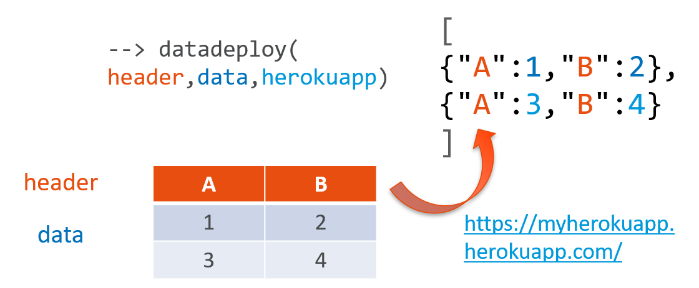

# datadeploy

Deploy your data as an API with a JSON format on Heroku

## Prerequisites:

* [Git](https://git-scm.com/book/en/v2/Getting-Started-Installing-Git) installed on your PC
* [Heroku](https://signup.heroku.com/) account with [Heroku CLI](https://devcenter.heroku.com/articles/heroku-cli) installed on your PC
* Make sure you have both *heroku* and *git* accessible in your PATH

## Setup:

* Login to heroku

    $ heroku login

* Create an app

    $ heroku create

(keep the app name to deploy your plot)

You can alternatively create the app from the Heroku website.

## Demo

In this simple demonstration, we deploy a Scilab plot on a simple URL:

    M = ['A','B';
        '1','2';
        '3','4']

    header = M(1,:)
    data = M(2:$,:)    
    herokuapp='datadeploy48';
    datadeploy(header,data,herokuapp)

JSON created at the address https://datadeploy48.herokuapp.com/

    [{"A":1,"B":2},{"A":3,"B":4}]

You simply need to replace the name of your heroku app to replicate it.

## Inspiration:
* [Pandas DataFrame to JSON](https://pandas.pydata.org/pandas-docs/stable/reference/api/pandas.DataFrame.to_json.html)
* [Grid Studio](https://hackernoon.com/introducing-grid-studio-a-spreadsheet-app-with-python-to-make-data-science-easier-tdup38f7)
* [Xlwings](https://docs.xlwings.org/en/stable/rest_api.html)
